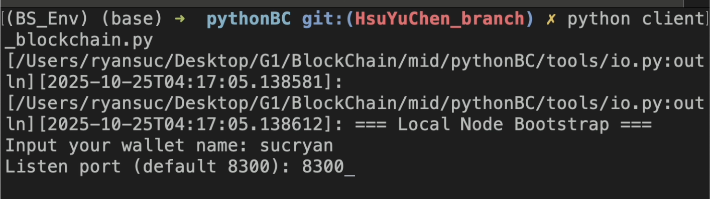
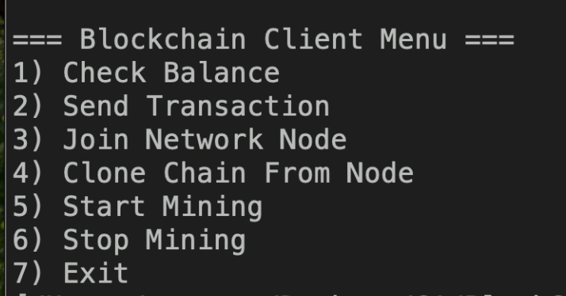

**注意注意 -> README made by Claude <-
10/24, 25 -> Modified by YuChen!

## 📋 目錄

- [功能特性](#-功能特性)
- [安裝指南](#-安裝指南)
- [快速開始](#-快速開始)
- [測試](#測試)
- [API 文檔](#-api-文檔)
- [技術細節](#-技術細節)
- [專案結構](#-專案結構)

---

## 🎯 功能特性

### 核心功能
- ✅ **Proof-of-Work 挖礦** - SHA3-256 雜湊算法
- ✅ **數位簽章** - RSA 1024-bit 加密
- ✅ **交易驗證** - 簽章驗證和餘額檢查
- ✅ **Merkle Tree** - 高效的交易完整性驗證
- ✅ **難度自動調整** - 根據平均區塊時間動態調整
- ✅ **P2P 網路** - 節點自動發現和區塊廣播
- ✅ **鏈同步** - 從其他節點複製區塊鏈
- ✅ 數位簽章 - ECDSA (Elliptic Curve Digital Signature Algorithm)

### 技術亮點
- 🔐 **安全性**: RSA 簽章 + SHA3-256 雜湊
- 🌐 **分散式**: 完整的 P2P 網路通訊
- 🧪 **測試覆蓋**: 94 個自動化測試
- 📦 **模組化設計**: 清晰的架構和易於擴展
- 🔑 橢圓曲線加密: 支援 secp256k1 與 NIST P-256 (secp256r1)

---

## 💻 安裝指南

### 系統需求
- Python 3.10 或更高版本
- pip (Python 套件管理器)
- 8GB RAM (建議)
- 多核 CPU (建議，用於並行挖礦)

### 安裝步驟

#### 1. 克隆專案
```bash
git clone <repository-url>
cd pythonBC
```
#### 2. 安裝依賴
```bash
pip install -r requirements.txt

# **依賴套件:**cryptography>=41.0.0    # RSA 加密和簽章
pytest>=7.4.0           # 測試框架

```
- optional -> venv
```bash
# 建立虛擬環境
python3 -m venv BS_Env

# 啟用環境(macOS, Linux)
source BS_Env/bin/activate

# 啟用環境(Windows)
BS_Env\Scripts\activate

# 安裝套件
pip install -r requirements.txt
```

#### 3. 驗證安裝
```bash執行所有測試
python -m pytest tests/ -v應該看到: 94 passed
```
---

## 🚀 快速開始

### 使用者介面模式
- 使用者介面
  - 登入畫面
    
  - 使用介面
    - 
  - 具體用法
    - 參考[p2p網路驗證](#-p2p-網路驗證)和底下的youtube影片示範

### 單節點模式

啟動一個區塊鏈節點:
```bash
python start_blockchain.py

預設配置:
- Wallet 名稱: `DefaultNode`
- 監聽埠號: `8300`
```
### 自訂節點

指定錢包名稱和埠號:
```bash
python start_blockchain.py Alice 8300
```
```bash
你會看到:[...] Account: MIGfMA0GCSqGSIb3DQEBAQUAA4G... loaded.
[...] Creating Genesis Block...
[...] Hash Found: 0abc123... @ Difficulty: 1, Time Cost: 0s
[...] Network Ready on port 8300
[...] Hash Found: 0def456... @ Difficulty: 1, Time Cost: 1s
```
### 停止節點

按 `Ctrl+C` 停止節點。

---

## 測試

### 執行所有測試
```bash
python -m pytest tests/ -v
```
### 分層測試
```bash
# Layer 1: 基礎工具 (28 tests)
python -m pytest tests/test_layer1.py -vLayer 2: 加密與簽章 (13 tests)
python -m pytest tests/test_layer2.py -vLayer 3: 資料結構 (27 tests)
python -m pytest tests/test_layer3.py -vLayer 4: 區塊鏈核心 (21 tests)
python -m pytest tests/test_layer4.py -vLayer 5: P2P Server (5 tests)
python -m pytest tests/test_layer5.py -v
```
### 測試覆蓋率
```markdown
| Layer | 功能 | 測試數 | 狀態 |
|-------|------|--------|------|
| Layer 1 | 基礎工具 | 28 | ✅ |
| Layer 2 | 加密簽章 | 13 | ✅ |
| Layer 3 | 資料結構 | 27 | ✅ |
| Layer 4 | 區塊鏈核心 | 21 | ✅ |
| Layer 5 | P2P Server | 5 | ✅ |
| **總計** | | **94** | **✅** |
```
---

### 🌐 P2P 網路驗證
- 執行下列指令，依照名稱輸入
```bash
python client_blockchain.py 
```
- 以sucryan 8300(genesis block)和sunny 8301為例:
  - 測試一：（測試基本傳輸效果）
    - 首先suuny先加入sucryan（command3），並且clone他的blockchain（command4）。
    - 然後sucryan也要加入(command3)。
    - 接下來sucryan send transaction（command2）, 建議可以send一個很怪的數字（ex. 1, 3之類的），比較看得出來（先以3為例）。
    - 然後讓sucryan自己去挖礦 -> sunny收到錢了！
  - 測試二：（測試blockchain同步問題）
    - 接下來換sunny把錢回傳給sucryan，這次以1為例子。
    - 一樣讓sucryan去挖，會發現sucryan就收得到錢（而且還會收到挖礦的收益），但是sunny卻沒有相應的扣錢。
    - 最後讓sunny去clone sucryan的blockchain，成功同步。
  - Youtube測試[影片](https://youtu.be/IZMCjwAovZc)。
<!-- ### 啟動多節點網路

在**三個不同的終端機**中執行:

#### Terminal 1: Node1 (Alice)
```bash
python start_blockchain.py Alice 8300
```
#### Terminal 2: Node2 (Bob)
```bash
python start_blockchain.py Bob 8301
```
#### Terminal 3: Node3 (Charlie)
```bash
python start_blockchain.py Charlie 8302
```
### 測試 P2P 連接

在**第四個終端機**中執行:
```bash
python verify_p2p.py
```
```bash
**預期輸出:**============================================================
P2P 區塊鏈網路驗證步驟 1: 建立節點網路
✓ Node1 → Node2: Ok
✓ Node1 → Node3: Ok
✓ Node2 → Node3: Ok步驟 2: 查詢各節點餘額
✓ Alice (Port 8300): 530.0 coins
✓ Bob (Port 8301): 530.0 coins
✓ Charlie (Port 8302): 520.0 coins步驟 3: 發送交易測試 (Alice → Bob)
✓ Transaction sent: Ok============================================================
驗證完成!
```
### 觀察 P2P 廣播

在各個節點的終端機中,你應該看到:
```bash
**Node1 (發送節點):**[...] Broadcasting broadcastedBlock, Block [previousHash:...
[...] Broadcasted to 127.0.0.1:8301
[...] It response T2s=
[...] Broadcasted to 127.0.0.1:8302
[...] It response T2s=

**Node2 & Node3 (接收節點):**[...] 127.0.0.1:xxxxx Connected.
[...] Received: broadcastedBlock, ...
[...] Block [...] Is a valid block
``` -->
---

## 📡 API 文檔

### 訊息類型

區塊鏈節點支援以下訊息類型:

#### 客戶端到伺服器

| 訊息類型 | 格式 | 說明 |
|---------|------|------|
| `getBalance` | `getBalance, <base64_address>` | 查詢帳戶餘額 |
| `doTransact` | `doTransact, <base64_transaction>` | 提交交易 |
| `joinNetwork` | `joinNetwork, <base64_node>` | 加入網路節點 |
| `cloneBlockchain` | `cloneBlockchain` | 複製完整區塊鏈 |
| `startMining` | `startMining` | 開始挖礦 |
| `stopMining` | `stopMining` | 停止挖礦 |

#### P2P 廣播

| 訊息類型 | 格式 | 說明 |
|---------|------|------|
| `broadcastedBlock` | `broadcastedBlock, <base64_block>` | 廣播新區塊 |
| `broadcastedTransaction` | `broadcastedTransaction, <base64_tx>` | 廣播新交易 |
| `broadcastedNewNode` | `broadcastedNewNode, <base64_node>` | 廣播新節點 |

### 使用範例

#### Python 客戶端範例
```python
import socket
from tools.converter import Converter連接到節點
client = socket.socket(socket.AF_INET, socket.SOCK_STREAM)
client.connect(('127.0.0.1', 8300))查詢餘額
message = f"getBalance, {Converter.string_to_base64(account_address)}\n"
client.sendall(message.encode('utf-8'))接收回應
response = client.recv(4096).decode('utf-8').strip()
balance = Converter.base64_to_string(response)
print(f"Balance: {balance}")client.close()
```
---

## 🔧 技術細節

### 加密技術

#### RSA 簽章
- **演算法**: RSA
- **金鑰長度**: 1024 bits
- **簽章算法**: SHA3-256withRSA
- **編碼**: DER format

#### 雜湊函數
- **演算法**: SHA3-256
- **輸出長度**: 64 hex characters (256 bits)
- **用途**: 區塊雜湊、交易雜湊、Merkle Tree

#### ECDSA 簽章
- 演算法: ECDSA (Elliptic Curve Digital Signature Algorithm)
- 支援曲線:
  - secp256k1 (比特幣使用)
  - secp256r1 (NIST P-256)
- 金鑰長度: 256 bits
- 簽章演算法: SHA3-256 + RFC 6979 決定性隨機數 (Deterministic k)
- 特性:
  - 比 RSA 更高效能與更短簽章
  - 支援 RFC 6979，避免隨機數重用造成私鑰洩漏
### 共識機制

#### Proof-of-Work (PoW)
```python
挖礦目標: hash 必須以 N 個 0 開頭
N = 難度 (difficulty)範例:
difficulty = 3
target = "000..."  # 3 個 0持續嘗試 nonce 直到:
hash(block_content + nonce).startswith(target)
```
#### 難度調整
```python
每 10 個區塊調整一次
目標: 平均 30 秒一個區塊if average_block_time > 30s:
difficulty -= 1  # 降低難度
else:
difficulty += 1  # 提高難度
```
### 資料結構

#### Transaction
```python
{
"sender": "MIGfMA0GCSqGSIb...",     # Base64 公鑰
"receiver": "MIGfMA0GCSqGSIb...",   # Base64 公鑰
"amount": 100.0,                    # 轉帳金額
"fee": 1.0,                         # 交易手續費
"timestamp": 1729472400000,         # 時間戳 (ms)
"message": "Payment",               # 備註
"signature": "AbCdEf..."            # Base64 簽章
}
```
#### Block
```python
{
"previousHash": "0abc123...",       # 前一區塊雜湊
"hash": "0def456...",               # 本區塊雜湊
"difficulty": 3,                    # 挖礦難度
"nonce": 12345,                     # PoW nonce
"timestamp": 1729472400000,         # 時間戳
"transactions": [...],              # 交易列表
"merkleRoot": "789ghi...",          # Merkle 樹根
"miner": "MIGfMA0GCSqGSIb...",     # 礦工地址
"minerRewards": 10.0                # 挖礦獎勵
}
```
---

## 📁 專案結構
```bash
pythonBC/
├── config/                          # 配置檔案
│   ├── init.py
│   ├── blockchain_config.py         # 區塊鏈參數
│   ├── io_config.py                 # I/O 設定
│   ├── network_config.py            # 網路設定
│   └── security_config.py           # 安全性設定
│
├── tools/                           # 工具模組
│   ├── init.py
│   ├── converter.py                 # Base64 編解碼
│   ├── hash_maker.py                # 雜湊計算
│   ├── instant_maker.py             # 時間戳工具
│   ├── nonce_maker.py               # Nonce 生成
│   ├── io.py                        # 檔案 I/O
│   └── security.py                  # 簽章驗證
│
├── blockchain_types/                # 區塊鏈資料結構
│   ├── init.py
│   ├── wallet.py                    # 錢包 (RSA 金鑰)
│   ├── transaction.py               # 交易
│   ├── transaction_merkle_tree.py   # Merkle Tree
│   ├── block.py                     # 區塊
│   ├── network_node.py              # 網路節點
│   ├── message_type.py              # 訊息類型
│   └── blockchain.py                # 區塊鏈核心
│
├── tests/                           # 測試檔案
│   ├── init.py
│   ├── test_layer1.py               # 基礎工具測試
│   ├── test_layer2.py               # 加密測試
│   ├── test_layer3.py               # 資料結構測試
│   ├── test_layer4.py               # 區塊鏈測試
│   └── test_layer5.py               # P2P 測試
│
├── wallets/                         # 錢包儲存 (自動生成)
│   └── <wallet_name>/
│       ├── publicKey.key
│       └── privateKey.key
│
├── start_blockchain.py              # 主程式
├── test_p2p.py                      # P2P 測試腳本
├── verify_p2p.py                    # P2P 驗證腳本
├── requirements.txt                 # Python 依賴
└── README.md                        # 本文件
```
---

## ⚙️ 配置參數

### blockchain_config.py
```python
ADJUST_DIFFICULTY_IN_EVERY = 10    # 每 10 個區塊調整難度
INIT_DIFFICULTY = 1                # 初始難度
BLOCK_TIME_IN_EVERY = 30           # 目標區塊時間 (秒)
MINING_REWARDS = 10.0              # 挖礦獎勵
MAX_TRANSACTIONS_IN_BLOCK = 32     # 單一區塊最大交易數

### network_config.py
```pythonSOCKET_HOST = "127.0.0.1"          # 伺服器地址
SOCKET_PORT = 8300                 # 預設埠號

### security_config.py
```pythonHASH_ALGORITHM = "sha3_256"        # 雜湊演算法
PUBLIC_KEY_ALGORITHM = "RSA"       # 公鑰演算法
PUBLIC_KEY_LENGTH = 1024           # RSA 金鑰長度
SIGNATURE_ALGORITHM = "SHA3-256withRSA"  # 簽章演算法
```
